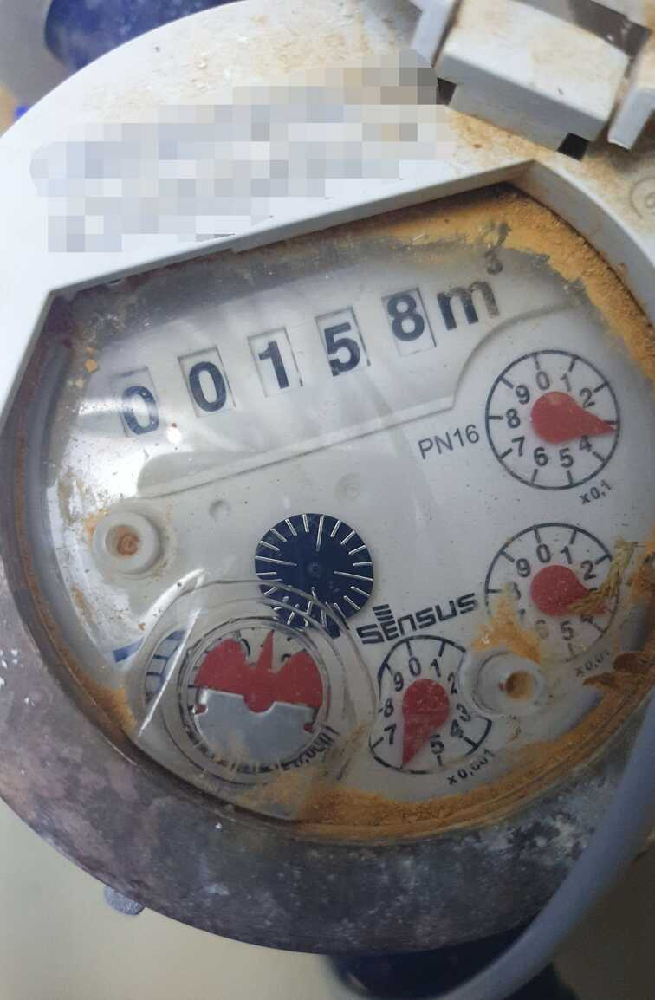
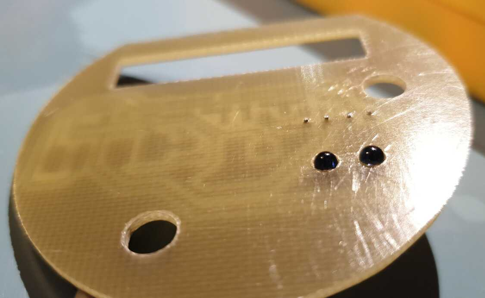
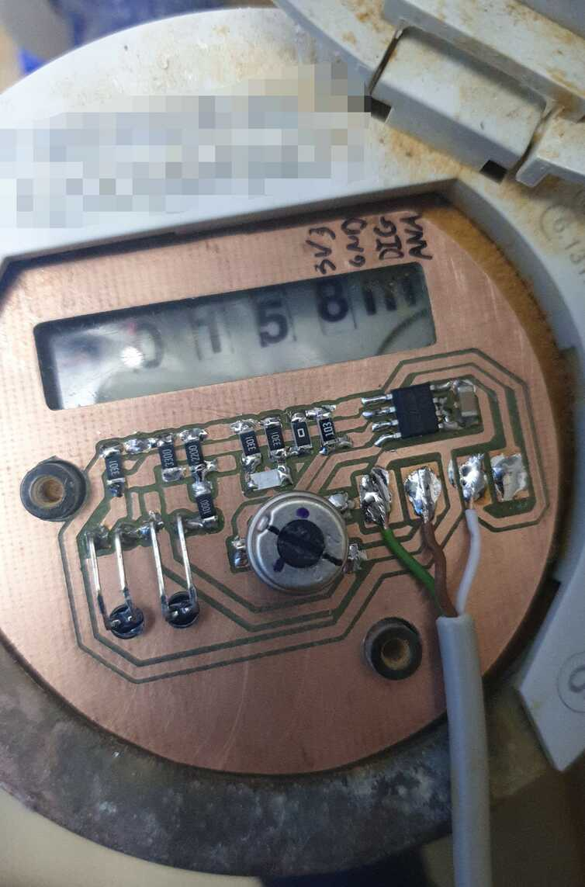

# Water meter
This is a simple sensor for Sensus PN16 water meters.
It uses an infrared LED and phototransistor to sense the metal disk on the
x0.0001 m³ pointer wheel.



Sensus do sell an inductive sensor for this type of meter (Sensus HRI),
but it is a bit pricey and needs batteries to operate.

I own a small CNC mill, so I decided to mill a custom PCB that matches the
shape of the meter. This allows me to easily mount it to the meter without the
need for custom 3D printed parts.

## Hardware
KiCAD designs for the PCB are available in the [`hardware`](hardware/)
directory.

**WARNING**: Make sure to read the notes in the schematic. Since this was a
one-off project, I did not spend much time fixing potential problems I
discovered after milling the board.




## Software
This part is a bit complicated. I connected the sensor to an STM32F103 board
that handles many other sensors in the room. I don't want to share the whole
source code (it wouldn't make much sense for anyone other than me), but I will
try to include the relevant parts here:

```cpp
#define DEBOUNCE_FREQUENCY 50  // HZ
// ...


unsigned int water_meter_pulses = 0;
static volatile unsigned int pulses = 0;

#define SAMPLING_FREQUENCY DEBOUNCE_FREQUENCY  // Hz
// max flow rate should be 1,39 l / s (2*Qn)
// 2 pulses per revolution
#define DEBOUNCE_TIME 320  // ms
#define INTEGRATOR_MAX (DEBOUNCE_TIME * SAMPLING_FREQUENCY / 1000)
/**
 * Read water meter state.
 * This function should be called from a timer ISR
 * DEBOUNCE_FREQUENCY times per second.
 */
void water_meter_debounce()
{
    static unsigned int integrator = 0;

    if (digitalRead(pin_water_meter))
    {
        if (integrator < INTEGRATOR_MAX) integrator++;
    }
    else
    {
        if (integrator > 0) integrator--;
    }

    static bool output = false;
    static bool prev_output = false;
    static bool first = true;
    if (integrator == 0)
    {
        output = false;
        if (first)
        {
            first = false;
            prev_output = output;
        }
    }

    if (integrator >= INTEGRATOR_MAX)
    {
        output = true;
        if (first)
        {
            first = false;
            prev_output = output;
        }
        // this should never be needed
        integrator = INTEGRATOR_MAX;
    }

    if (output != prev_output)
    {
        prev_output = output;
        pulses++;  // incremented at every edge (0.5 l)
    }
}


void water_meter_setup()
{
    // extra pull-up might help with noise immunity
    pinMode(pin_water_meter, INPUT_PULLUP);
}


void water_meter_loop()
{
    noInterrupts();
    water_meter_pulses = pulses;
    interrupts();
}


// mqtt.cpp
void mqtt_loop()
{
    // ...
    static unsigned int prev_water_meter_pulses = 0;
    if (force_report || water_meter_pulses != prev_water_meter_pulses)
    {
        prev_water_meter_pulses = water_meter_pulses;
        char buff[3*sizeof(water_meter_pulses) + 1]; // >= number of digits + null
        snprintf(buff, sizeof buff, "%u", water_meter_pulses);
        MQTTClient.publish(MQTTtopic_water_meter_pulses, buff, true);
    }
}
```


## Home Assistant
[Home Assistant](https://www.home-assistant.io/) can be used to receive MQTT
messages sent by the device and track water consumption.

```yaml
recorder:
  exclude:
    entities:
      # do not store the intermediate sensor's state history in the database
      - sensor.water_meter_pulses

mqtt:
  sensor:
    - name: Water meter pulses
      state_topic: rolety/tele/water_meter/pulses
      availability_topic: rolety/tele/availability
      unit_of_measurement: "pulses"

template:
  - sensor:
    - name: Water meter
      unit_of_measurement: "m³"
      state: '{{ states("sensor.water_meter_pulses") | int(0) / 2000.0 }}'
      availability: '{{ has_value("sensor.water_meter_pulses") }}'
      device_class: water
      state_class: total_increasing
```
`sensor.water_meter` has the proper `state_class` and `device_class`, so it
can be used with the [energy dashboard](https://www.home-assistant.io/dashboards/energy/).


## Similar projects
- http://jheyman.github.io/blog/pages/WirelessWaterMeter/
